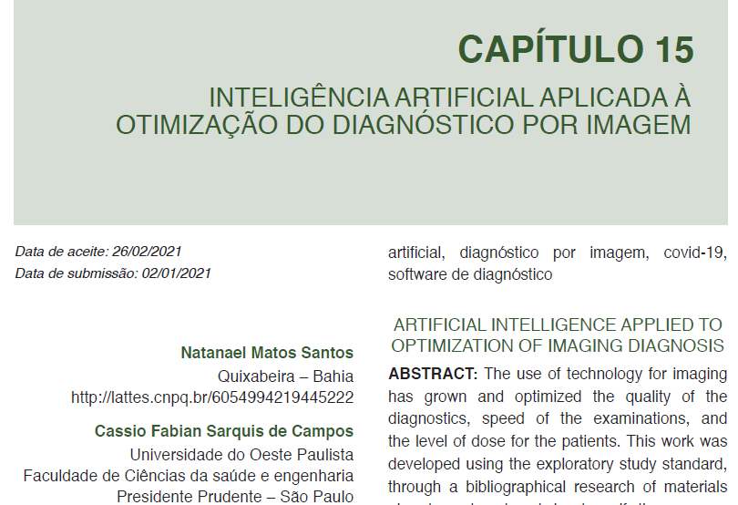

# Introdução à inteligência artificial, histórico, estado da arte, benefícios e riscos. Agentes inteligentes, ambientes e racionalidade.
 
 UNB

## O que é inteligencia artificial

Presente no imáginário de escitores como Azimov, em filmes ou em mitologias, a inteligência artificial foi definida por John McCarthy como "a ciência e a engenharia de fabricar máquinas inteligentes, especialmente programas de computador inteligentes", tendo isso e com maior aprofundamento do assundo ao longo dos anos, a inteligência artificial busca fazer com que as máquinas consigam solucinar problemas com tomadas de decisão e aprendizado de um objetivo específico. Com isso algumas métodos foram desenvolvidos para a aplicação desse conceito no qual se destacam  Machine Learning ou Aprendizado de Máquina, Processamento de Linguagem Natural (PLN) e Visão Computacional.

 
<figcaption> </figcaption>

 Está imagem fo feita pela inteligencia artificial do bing e tenta fazer um resumo da introdução

### 1.1  Histórico

O termo Inteligência artificial foi criado em 1956 por John McCarthy além de criar uma conferência na Darthmouth College em 1956 para debater o assunto e reunir pesquisadores da área. O sucesso inicial surgiu com o **General Problem Solver (Solucionador de Problemas Gerais)**, ou GPS, desenvolvido por Newell e Simon e também o sucesso de Alan Turing na segunda guerra mundical com seu decodificador de mensagens. Já se havia antes da conferência os seguintes estudos e criações:
 

 * Warren McCulloc e Walter Pitts datados 1943 com seu modelo de neurônios utilizando conectivos lógicos
 * Donald Hebb em 1949 com a aprendizagem Hebbiana
 * Harvard, Marvin Minsky e Dean Edmonds com o primeiro computador de rede neural, o SNARC
 * Alan Turing com o teste de Turing utilizada na segunda guerra mundial e seus estudos computacionais

 
<figcaption> </figcaption>

 Principais Pensadores da Conferência de Darthmouth

Alguns anos depois pela décadas de 60 a inteligência artificial só conseguia resolver problemas simples, muito envolvendo a porta lógica xor. No início da década de 70 uma empresa começou a utilizar sistemas em IA dando uma nova vida a essa pratíca com sisttemas especialistas, que resolviam problemas especifícos gerando muito lucro às empresas. Na década de 80 acontece o Inverno IA, em quel a inteligência artificial é deixada um pouco de lado por não cumprir muitas de suas promessas além de várias falhas quando oissuia domínios mais complexos.

Em 1986 retornam os estudos com redes neurais com modelos conexionistas, em sistemas que conseguem aprender com exemplos, testes ou erros além de serem adaptáveis. Por estar se afastando da ciência da computação e da teoria clássica David McAllester entendeu que  "aprendizado de máquina não deve ser isolado da teoria da informação, raciocínio incerto não deve ser isolado da modelagem estocástica, que busca não deve ser isolada da otimização e controle clássicos, e que o raciocínio automatizado não deve ser isolado de métodos formais e análise estática".

Com o tempo avanços notáveis apareceram como o World Wide Web, o Big Data, que são conjuntos de dados de todos os tipos, incluindo dados grandes, que favoreceram a utilização de aprendizado de máquina, por desenvolvimentos de algorítimos cada vez melhores e cada vez mais precisos, e com o volume de dados aumentando constantemente o avanço nessa tecnologia avança em conjunto. 

Um dos avanços é o Deep learning, que volta com força em 2011 utilizando de várias camadas da computação para seu aprendizado, reconhecendo fala e até objetos e superando os desempenho humano em várias categorias.

## 1.2 Estado da Arte

O estado da arte em IA é um termo usado para descrever o nível mais alto de conhecimento e desenvolvimento em inteligência artificial. Ele é constantemente atualizado à medida que novas pesquisas e avanços são feitos na área, como na *The One Hundred Year Study on Artificial Intelligence*, or *AI100*, é um esforço de 100 anos para estudar e antecipar como os efeitos da inteligência artificial afetarão todos os aspectos do cotidiano das pessoas. 

Com o crescimento da inteligência artificial no mundo, a busca por esse conhecimento tanto na área de estudo como na área comercial aumentou muito nos últimos anos, assim com demonstra no *AI index* em seu relatorio de 2022. Com o desenvolvimento nessa área muitas tecnologias estão aparecento, como em carros automáticos, sistemas de correções por computador, análises comportamentais e outros.

A inteligência artificial traz vários benefícios, como acelearar o desenvolvimento tecnológico e atuar em inúmeras áreas de trabalho, mas também traz riscos quanto quem as programa e suas inteções diante dessa poderosa ferramenta computacional.

## 1.3 Agentes, ambientes e racionalidade

O agente é aquele que recebe a programação e o que deve realizar a ação,  que foi previamente oservada e através de sua função atua, ou seja, ou seja, a ação do agente depende da sua programação agente, seus comandos de ação,  e sua função agente que é o mapeamento e percepção do agente.   

O racional divide-se em pontos caracteríscticos, sendo eles os critérios de sucesso, o conhecimento sobre o ambiente, as ações que consegue realizar, e depois de apurado suas decisões
A racionalidade do sistema se divide em dois conceitos, o consequencialismo em que faz-se uma espécie de filtro entre boas açóes e más consequências, e a medida de performace inserido pelo programador, podendo ter maior complexidade e de forma explicita ou implicita. Essas medidas buscam selecionar ações que maximizem ao máximo seu desenpenho dado os conteúdos fornecidos e qualquer conhecimento prévio.

Com o intuito de peojetar um agente deve-se prestar atenção na ornganização do agentem especificando o maior número de detalhes do ambiente assim como sua tarefa.
Ao projetar um agente, o primeiro passo deve ser sempre especificar o ambiente de tarefa da forma mais completa possível, com isso utiliza-se o PEAS.

Descrição PEAS (Performance, Environment, Actuators, Sensors)
Depois da definição do Agente as seguintes perguntas devem ser respondidas:
* Qual é a medida de performance desejada?
* Com é o ambiente da tarefa?
* Quais são os atuadores disponíveis para desempenhar ações?
* Quais são os sensores disponíveis para explorar o ambiente?

Agora também define-se os tipos de agentes que são orientados por tabela:

* Agentes de reflexo simples (Simple reflex agents);
* Agentes de reflexo baseado em modelo (Model-based reflex agents);
* Agentes baseados em objetivos(Goal-based agents);
* Agentes utilitários (Utility-based agents).

A representação estados dos agentes são feitos da seguinte forma, sendo ela de forma local ou distribuída:

* Representação atômica: pesquisa, jogos, Modelos de Markov ocultos, Processos de decisão de Markov, etc.
* Representação fatorial: Algoritmos de satisfação de restrição, lógica proposicional, machine learning, redes bayesianas, etc.
* Representação estruturada: Base de dados relacionais, lógica de 1ª ordem, modelos probabilísticos de 1ª ordem, linguagem natural, etc.

## 1.4 Contribuições 
 ### a. Discussões: 
  Acredito que estamos em uma fase de crescente sobre inteligência artificial e talvez um dos grandes momonetos sobre essa tecnologia, hoje ajustes  e correções por computarores estão conseguindo alcançar níveis de exelência como os dos foguetes, automóveis e ciências médicas. 
  Possivelmente muitas questões éticas estão aparencendo, como as de liberdade de expressão, sobre o certo e o errado e até onde podemos aplicar essa tecnologia de maneira com que contribua para a sociedade. Mas é fato que temos muito a ganhar com suas aplicações e que muitos acreditam que seja o próximo boom tecnológico, só de se pensar que cada vez mais conseguimos atribuir grandes quantidades de tarefas pra essa tecnologia e ganhamos tempo com isso, o tempo ganho em empresas também se torna grande.

### B. Projetos e problemas:

 Um bom projeto é o de identificação de doenças por reconhecimento de imagens e super resolução por IA, como demonstrado nas imagens abaixo, em que alguns casos identifica casos de cancer com mais precisão que o olho humano.

PEAS do projeto de identificação de doenças por reconhecimento de imagens e super resolução:

*Qual é a medida de performance desejada?
  * É necessário uma precisão alta e confiabilidade, pois se trada de vidas humanos em risco, uma ambiente que facilite o trabalho do médico e do paciente.
* Com é o ambiente da tarefa?
  * Corpo humano e doeças que possam ser identificados por imagens
* Quais são os atuadores disponíveis para desempenhar ações?
  * Tela que demonstras os resultados e com demonstrativos dos resultados obtidos
* Quais são os sensores disponíveis para explorar o ambiente?
  * Câmeras, imagens de ultrassom e imagens de raio x.

 
<figcaption> </figcaption>

 Está imagem fo feita pela inteligencia artificial do bing e tenta fazer um resumo da introdução

 
<figcaption> </figcaption>

 Está imagem fo feita pela inteligencia artificial do bing e tenta fazer um resumo da introdução

## Referências

1. https://www.politize.com.br/inteligencia-artificial/
2. https://www.sas.com/pt_br/insights/analytics/machine-learning.html
3. https://www.tecnologiae.com.br/aprendizado-maquina/)
4. https://fia.com.br/blog/inteligencia-artificial/
5. https://www.programaria.org/quais-sao-os-tipos-de-aplicacoes-de-inteligencia-artificial-mais-comuns/
1. x2inteligencia.digital
2. tecnicon.com.br
3. epocanegocios.globo.com
4. nationalgeographicbrasil.com
1. warren.com.br
2. ebiografia.com
3. tecnoblog.net
4. bing.com
2. sas.com
3. fia.com.br
4. neilpatel.com
2. mittechreview.com.br
3. bing.com
4. take.net
5. each.usp.br
3. nvidia.com
3. blog.stoodi.com.br
4. iaexpert.academy
1. bing.com
2. redhat.com
3. learn.microsoft.com
4. dca.fee.unicamp.br
1. europarl.europa.eu
2. bing.com
3. ebit.pt
4. brasilescola.uol.com.br
5. fia.com.br
