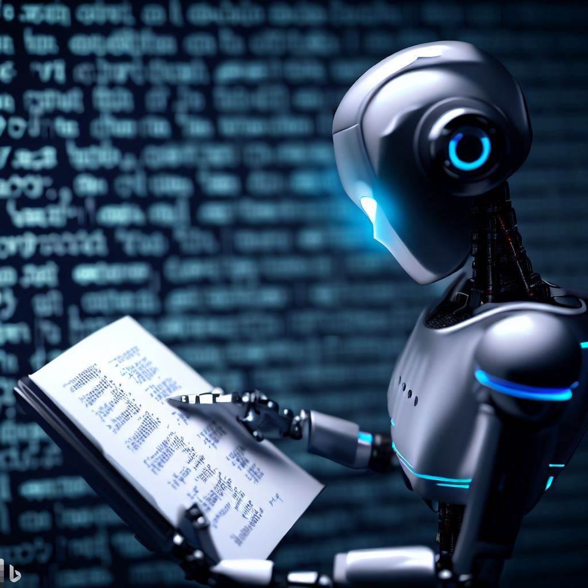

# Introdução à inteligência artificial, histórico, estado da arte, benefícios e riscos. Agentes inteligentes, ambientes e racionalidade.
 
 UNB

## O que é inteligencia artificial
  
A inteligência artificial foi definida por John McCarthy "a ciência e a engenharia de fabricar máquinas inteligentes, especialmente programas de computador inteligentes", tendo isso e com maior aprofundamento do assundo ao longo dos anos, a inteligência artificial busca fazer com que as máquinas consigam solucinar problemas com tomadas de decisão e aprendizado de um objetivo específico. Com isso algumas métodos foram desenvolvidos para a aplicação desse conceito no qual se destacam  Machine Learning ou Aprendizado de Máquina, Processamento de Linguagem Natural (PLN) e Visão Computacional.

<figure>
 
<figcaption>Está imagem tem a intenção de demonstra uma pesquisa feita pela máquina tendo e definindo a melhor opção com seu algorítimo </figcaption>
</figure>

### 1.1  

## Referências

Inteligência artificial (IA) é a capacidade de uma máquina para reproduzir competências semelhantes às humanas como raciocínio, aprendizagem, planeamento e criatividade. A IA permite que os sistemas técnicos percebam o ambiente que os rodeia, lidem com o que percebem e resolvam problemas, agindo no sentido de alcançar um objetivo específico1.

Os principais tópicos que definem a IA incluem aprendizagem de máquina, processamento de linguagem natural, visão computacional e robótica. Alguns exemplos do uso quotidiano da IA incluem assistentes virtuais, software de análise de imagem, motores de busca e sistemas de reconhecimento facial e de voz1.

Gostaria de saber mais sobre algum tópico específico?

Mensagem recebida. Inteligência artificial (IA) é a capacidade de uma máquina para reproduzir competências semelhantes às humanas como raciocínio, aprendizagem, planeamento e criatividade. A IA permite que os sistemas técnicos percebam o ambiente que os rodeia, lidem com o que percebem e resolvam problemas, agindo no sentido de alcançar um objetivo específico. Os principais tópicos que definem a IA incluem aprendizagem de máquina, processamento de linguagem natural, visão computacional e robótica. Alguns exemplos do uso quotidiano da IA incluem assistentes virtuais, software de análise de imagem, motores de busca e sistemas de reconhecimento facial e de voz. Gostaria de saber mais sobre algum tópico específico?

John McCarthy definiu inteligência artificial como “a ciência e a engenharia de fabricar máquinas inteligentes, especialmente programas de computador inteligentes. Ela está relacionada à tarefa semelhante de usar computadores para entender a inteligência humana, mas a IA não precisa se limitar aos métodos biologicamente observáveis” 1.

Gostaria de saber mais sobre a história da inteligência artificial?

A principal diferença entre um programa comum e um que utiliza inteligência artificial é a capacidade de aprender e tomar decisões com base em dados. Enquanto um programa comum segue um conjunto pré-definido de instruções para realizar uma tarefa específica, um programa que utiliza inteligência artificial é capaz de aprender a partir de dados e tomar decisões ou realizar ações com base nesse aprendizado.

Isso significa que um programa que utiliza inteligência artificial pode se adaptar e melhorar ao longo do tempo, à medida que recebe mais dados e aprende com eles. Além disso, ele pode ser capaz de realizar tarefas mais complexas e tomar decisões mais precisas do que um programa comum.

Gostaria de saber mais sobre como a inteligência artificial é usada em programas?

Inteligência artificial é usada em muitos tipos diferentes de programas e aplicações. Aqui estão alguns exemplos:

Jogos: A inteligência artificial é usada para criar personagens não jogáveis (NPCs) mais realistas e desafiadores, bem como para melhorar a jogabilidade e a experiência do usuário.

Assistentes virtuais: A inteligência artificial é usada em assistentes virtuais como Siri, Alexa e Google Assistant para entender e responder a comandos de voz, realizar tarefas e fornecer informações úteis.

Sistemas de recomendação: A inteligência artificial é usada em sistemas de recomendação, como os encontrados em sites de compras ou serviços de streaming, para fornecer sugestões personalizadas com base nas preferências e comportamentos do usuário.

Esses são apenas alguns exemplos de como a inteligência artificial é usada em programas. Existem muitas outras aplicações possíveis.

Gostaria de saber mais sobre algum desses exemplos ou sobre outras aplicações da inteligência artificial?

Saiba mais:

[1. europarl.europa.eu
2. bing.com
3. ebit.pt
4. brasilescola.uol.com.br
5. fia.com.br
6. (https://www.politize.com.br/inteligencia-artificial/
7. https://www.sas.com/pt_br/insights/analytics/machine-learning.html
8. https://www.tecnologiae.com.br/aprendizado-maquina/)
9. https://fia.com.br/blog/inteligencia-artificial/
10. https://www.programaria.org/quais-sao-os-tipos-de-aplicacoes-de-inteligencia-artificial-mais-comuns/
