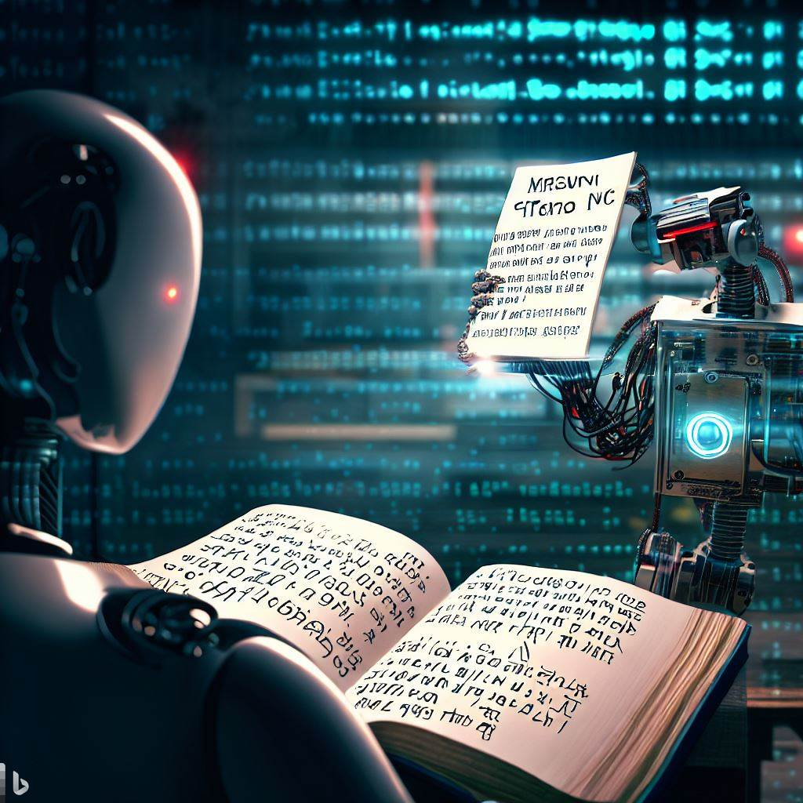
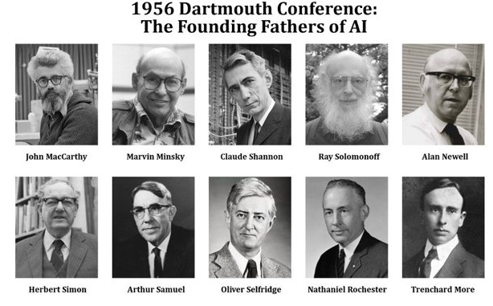

# Introdução à inteligência artificial, histórico, estado da arte, benefícios e riscos. Agentes inteligentes, ambientes e racionalidade.
 
 UNB

## O que é inteligencia artificial

Presente no imáginário de escitores como Azimov, em filmes ou em mitologias, a inteligência artificial foi definida por John McCarthy como "a ciência e a engenharia de fabricar máquinas inteligentes, especialmente programas de computador inteligentes", tendo isso e com maior aprofundamento do assundo ao longo dos anos, a inteligência artificial busca fazer com que as máquinas consigam solucinar problemas com tomadas de decisão e aprendizado de um objetivo específico. Com isso algumas métodos foram desenvolvidos para a aplicação desse conceito no qual se destacam  Machine Learning ou Aprendizado de Máquina, Processamento de Linguagem Natural (PLN) e Visão Computacional.

 
<figcaption> </figcaption>

 Está imagem fo feita pela inteligencia artificial do bing e tenta fazer um resumo da introdução

### 1.1  Histórico

O termo Inteligência artificial foi criado em 1956 por John McCarthy além de criar uma conferência na Darthmouth College em 1956 para debater o assunto e reunir pesquisadores da área. O sucesso inicial surgiu com o **General Problem Solver (Solucionador de Problemas Gerais)**, ou GPS, desenvolvido por Newell e Simon e também o sucesso de Alan Turing na segunda guerra mundical com seu decodificador de mensagens. Já se havia antes da conferência os seguintes estudos e criações:
 

 * Warren McCulloc e Walter Pitts datados 1943 com seu modelo de neurônios utilizando conectivos lógicos
 * Donald Hebb em 1949 com a aprendizagem Hebbiana
 * Harvard, Marvin Minsky e Dean Edmonds com o primeiro computador de rede neural, o SNARC
 * Alan Turing com o teste de Turing utilizada na segunda guerra mundial e seus estudos computacionais

 
<figcaption> </figcaption>

 Principais Pensadores da Conferência de Darthmouth

Alguns anos depois pela décadas de 60 a inteligência artificial só conseguia resolver problemas simples, muito envolvendo a porta lógica xor. No início da década de 70 uma empresa começou a utilizar sistemas em IA dando uma nova vida a essa pratíca com sisttemas especialistas, que resolviam problemas especifícos gerando muito lucro às empresas. Na década de 80 acontece o Inverno IA, em quel a inteligência artificial é deixada um pouco de lado por não cumprir muitas de suas promessas além de várias falhas quando oissuia domínios mais complexos.

Em 1986 retornam os estudos com redes neurais com modelos conexionistas, em sistemas que conseguem aprender com exemplos, testes ou erros além de serem adaptáveis. Por estar se afastando da ciência da computação e da teoria clássica David McAllester entendeu que  "aprendizado de máquina não deve ser isolado da teoria da informação, raciocínio incerto não deve ser isolado da modelagem estocástica, que busca não deve ser isolada da otimização e controle clássicos, e que o raciocínio automatizado não deve ser isolado de métodos formais e análise estática".

Com o tempo avanços notáveis apareceram como o Big Data

## Referências

Inteligência artificial (IA) é a capacidade de uma máquina para reproduzir competências semelhantes às humanas como raciocínio, aprendizagem, planeamento e criatividade. A IA permite que os sistemas técnicos percebam o ambiente que os rodeia, lidem com o que percebem e resolvam problemas, agindo no sentido de alcançar um objetivo específico1.

Os principais tópicos que definem a IA incluem aprendizagem de máquina, processamento de linguagem natural, visão computacional e robótica. Alguns exemplos do uso quotidiano da IA incluem assistentes virtuais, software de análise de imagem, motores de busca e sistemas de reconhecimento facial e de voz1.

Gostaria de saber mais sobre algum tópico específico?

Mensagem recebida. Inteligência artificial (IA) é a capacidade de uma máquina para reproduzir competências semelhantes às humanas como raciocínio, aprendizagem, planeamento e criatividade. A IA permite que os sistemas técnicos percebam o ambiente que os rodeia, lidem com o que percebem e resolvam problemas, agindo no sentido de alcançar um objetivo específico. Os principais tópicos que definem a IA incluem aprendizagem de máquina, processamento de linguagem natural, visão computacional e robótica. Alguns exemplos do uso quotidiano da IA incluem assistentes virtuais, software de análise de imagem, motores de busca e sistemas de reconhecimento facial e de voz. Gostaria de saber mais sobre algum tópico específico?

John McCarthy definiu inteligência artificial como “a ciência e a engenharia de fabricar máquinas inteligentes, especialmente programas de computador inteligentes. Ela está relacionada à tarefa semelhante de usar computadores para entender a inteligência humana, mas a IA não precisa se limitar aos métodos biologicamente observáveis” 1.

Gostaria de saber mais sobre a história da inteligência artificial?

A principal diferença entre um programa comum e um que utiliza inteligência artificial é a capacidade de aprender e tomar decisões com base em dados. Enquanto um programa comum segue um conjunto pré-definido de instruções para realizar uma tarefa específica, um programa que utiliza inteligência artificial é capaz de aprender a partir de dados e tomar decisões ou realizar ações com base nesse aprendizado.

Isso significa que um programa que utiliza inteligência artificial pode se adaptar e melhorar ao longo do tempo, à medida que recebe mais dados e aprende com eles. Além disso, ele pode ser capaz de realizar tarefas mais complexas e tomar decisões mais precisas do que um programa comum.

Gostaria de saber mais sobre como a inteligência artificial é usada em programas?

Inteligência artificial é usada em muitos tipos diferentes de programas e aplicações. Aqui estão alguns exemplos:

Jogos: A inteligência artificial é usada para criar personagens não jogáveis (NPCs) mais realistas e desafiadores, bem como para melhorar a jogabilidade e a experiência do usuário.

Assistentes virtuais: A inteligência artificial é usada em assistentes virtuais como Siri, Alexa e Google Assistant para entender e responder a comandos de voz, realizar tarefas e fornecer informações úteis.

Sistemas de recomendação: A inteligência artificial é usada em sistemas de recomendação, como os encontrados em sites de compras ou serviços de streaming, para fornecer sugestões personalizadas com base nas preferências e comportamentos do usuário.

Esses são apenas alguns exemplos de como a inteligência artificial é usada em programas. Existem muitas outras aplicações possíveis.

Gostaria de saber mais sobre algum desses exemplos ou sobre outras aplicações da inteligência artificial?

Desojo saber a história da inteligência artificial e com tópicos dos principais acontecimentos
Mensagem enviada. Desojo saber a história da inteligência artificial e com tópicos dos principais acontecimentos
Procurando por “história da inteligência artificial principais acontecimentos”

Procurando por “história da inteligência artificial principais acontecimentos”

Gerando respostas para você…

Gerando respostas para você…

A história da inteligência artificial começa após a Segunda Guerra Mundial e envolve diversos cientistas como Alan Turing, Marvin Minsky, John McCarthy, Allen Newell e Herbert A. Simon1. O termo “inteligência artificial” foi criado em 1956, mas foi popularizado apenas nos dias de hoje, graças ao crescente volume de dados disponíveis, algoritmos e armazenamentos computacionais2. O sucesso inicial surgiu com o General Problem Solver (Solucionador de Problemas Gerais) - ou GPS - desenvolvido por Newell e Simon2.

Um dos principais acontecimentos na história da inteligência artificial foi a Conferência de Inteligência Artificial na Darthmouth College em 1956. John McCarthy, professor de matemática do Dartmouth College, cunhou o termo “inteligência artificial” e organizou uma conferência de IA no ano seguinte. Pesquisadores discutiram sobre as várias áreas com potencial para o estudo de IA, como aprendizado e pesquisa, visão, raciocínio, linguagem e cognição, jogos (principalmente xadrez) e interações humanas com máquinas inteligentes, como robôs pessoais. O consenso nas discussões foi que a IA tinha um grande potencial para beneficiar os humanos3.

Gostaria de saber mais sobre algum tópico específico?

Mensagem recebida. A história da inteligência artificial começa após a Segunda Guerra Mundial e envolve diversos cientistas como **Alan Turing**, **Marvin Minsky**, **John McCarthy**, **Allen Newell** e **Herbert A. Simon**. O termo "inteligência artificial" foi criado em 1956, mas foi popularizado apenas nos dias de hoje, graças ao crescente volume de dados disponíveis, algoritmos e armazenamentos computacionais. O sucesso inicial surgiu com o **General Problem Solver (Solucionador de Problemas Gerais)** - ou GPS - desenvolvido por Newell e Simon. Um dos principais acontecimentos na história da inteligência artificial foi a Conferência de Inteligência Artificial na Darthmouth College em 1956. John McCarthy, professor de matemática do Dartmouth College, cunhou o termo "inteligência artificial" e organizou uma conferência de IA no ano seguinte. Pesquisadores discutiram sobre as várias áreas com potencial para o estudo de IA, como aprendizado e pesquisa, visão, raciocínio, linguagem e cognição, jogos (principalmente xadrez) e interações humanas com máquinas inteligentes, como robôs pessoais. O consenso nas discussões foi que a IA tinha um grande potencial para beneficiar os humanos. Gostaria de saber mais sobre algum tópico específico?
Saiba mais:
1. x2inteligencia.digital
2. tecnicon.com.br
3. epocanegocios.globo.com
4. nationalgeographicbrasil.com
+2 mais
1
de
20
quando e onde foram criados o termo inteligência artificial
Mensagem enviada. quando e onde foram criados o termo inteligência artificial
O termo “inteligência artificial” foi criado em 1956 por John McCarthy, professor de matemática do Dartmouth College. Ele organizou uma conferência de IA no ano seguinte na Darthmouth College .

Gostaria de saber mais sobre a Conferência de Inteligência Artificial na Darthmouth College?

Mensagem recebida. O termo "inteligência artificial" foi criado em 1956 por John McCarthy, professor de matemática do Dartmouth College. Ele organizou uma conferência de IA no ano seguinte na Darthmouth College . Gostaria de saber mais sobre a Conferência de Inteligência Artificial na Darthmouth College?
2
de
20
Sim, me conte mais sobre a Conferência de Inteligência Artificial na Darthmouth College.
Mensagem enviada. Sim, me conte mais sobre a Conferência de Inteligência Artificial na Darthmouth College.
A Conferência de Inteligência Artificial na Darthmouth College em 1956 foi organizada por John McCarthy, professor de matemática do Dartmouth College. Ele cunhou o termo “inteligência artificial” e organizou uma conferência de IA no ano seguinte. Pesquisadores discutiram sobre as várias áreas com potencial para o estudo de IA, como aprendizado e pesquisa, visão, raciocínio, linguagem e cognição, jogos (principalmente xadrez) e interações humanas com máquinas inteligentes, como robôs pessoais. O consenso nas discussões foi que a IA tinha um grande potencial para beneficiar os humanos.

Gostaria de saber mais sobre algum tópico específico?

Mensagem recebida. A Conferência de Inteligência Artificial na Darthmouth College em 1956 foi organizada por John McCarthy, professor de matemática do Dartmouth College. Ele cunhou o termo "inteligência artificial" e organizou uma conferência de IA no ano seguinte. Pesquisadores discutiram sobre as várias áreas com potencial para o estudo de IA, como aprendizado e pesquisa, visão, raciocínio, linguagem e cognição, jogos (principalmente xadrez) e interações humanas com máquinas inteligentes, como robôs pessoais. O consenso nas discussões foi que a IA tinha um grande potencial para beneficiar os humanos. Gostaria de saber mais sobre algum tópico específico?
3
de
20
Quais foram os principais resultados da conferência?
Mensagem enviada. Quais foram os principais resultados da conferência?
A Conferência de Inteligência Artificial na Darthmouth College em 1956 foi um evento importante para o estudo da IA. Pesquisadores discutiram sobre as várias áreas com potencial para o estudo de IA e o consenso nas discussões foi que a IA tinha um grande potencial para beneficiar os humanos. No entanto, eu não tenho informações específicas sobre os resultados da conferência.

Gostaria de saber mais sobre algum outro tópico?

Mensagem recebida. A Conferência de Inteligência Artificial na Darthmouth College em 1956 foi um evento importante para o estudo da IA. Pesquisadores discutiram sobre as várias áreas com potencial para o estudo de IA e o consenso nas discussões foi que a IA tinha um grande potencial para beneficiar os humanos. No entanto, eu não tenho informações específicas sobre os resultados da conferência. Gostaria de saber mais sobre algum outro tópico?
4
de
20
gostaria de saber as pessoas mais importantes relacionadas à inteligência artificial e qual sua contribuição na história
Mensagem enviada. gostaria de saber as pessoas mais importantes relacionadas à inteligência artificial e qual sua contribuição na história
Algumas das pessoas mais importantes relacionadas à inteligência artificial e suas contribuições na história incluem:

Alan Turing: Ele foi um matemático, cientista da computação e criptoanalista britânico conhecido pelo trabalho inovador, durante a Segunda Guerra Mundial, que ajudou a decodificar mensagens alemãs. Turing desenvolveu a base da computação moderna e é considerado por muitos como o pai da inteligência artificial e da ciência computacional12.
John McCarthy: Ele foi um professor de matemática do Dartmouth College que cunhou o termo “inteligência artificial” em 1956 e organizou uma conferência de IA no ano seguinte. McCarthy conseguiu grandes avanços em seu laboratório, um dos primeiros dedicados ao desenvolvimento da inteligência artificial. Ele ganhou o prêmio Turing em 1971, dado a cientistas de computação que fizeram grandes e duradoras contribuições para a área3.
Isaac Asimov: Ele foi um escritor de ficção científica que propôs as Três Leis da Robótica, estabelecendo princípios de convívio entre humanos e máquinas inteligentes4.
Frank Rosenblatt: Ele foi um psicólogo que construiu um modelo eletromecânico chamado Mark I Perceptron, que hoje fica no museu Smithsonian. Era uma rede neural analógica formada por uma grade de células fotoelétricas conectadas por fios a bancos de nós, contendo motores elétricos com resistores rotativos. Rosenblatt desenvolveu um “Algoritmo Perceptron” que orientava a rede
Mensagem recebida.
Saiba mais:
1. warren.com.br
2. ebiografia.com
3. tecnoblog.net
4. bing.com
5
de
20
Frank Rosenblatt e inteligência artificial
Mensagem enviada. Frank Rosenblatt e inteligência artificial
Frank Rosenblatt foi um psicólogo que construiu um modelo eletromecânico chamado Mark I Perceptron, que hoje fica no museu Smithsonian. Era uma rede neural analógica formada por uma grade de células fotoelétricas conectadas por fios a bancos de nós, contendo motores elétricos com resistores rotativos. Rosenblatt desenvolveu um “Algoritmo Perceptron” que orientava a rede a ajustar gradualmente suas forças de entrada até identificarem objetos de maneira consistente e correta, permitindo que ela aprendesse.

Gostaria de saber mais sobre algum outro tópico?

Mensagem recebida. Frank Rosenblatt foi um psicólogo que construiu um modelo eletromecânico chamado Mark I Perceptron, que hoje fica no museu Smithsonian. Era uma rede neural analógica formada por uma grade de células fotoelétricas conectadas por fios a bancos de nós, contendo motores elétricos com resistores rotativos. Rosenblatt desenvolveu um "Algoritmo Perceptron" que orientava a rede a ajustar gradualmente suas forças de entrada até identificarem objetos de maneira consistente e correta, permitindo que ela aprendesse. Gostaria de saber mais sobre algum outro tópico?
6
de
20
quem desenvolveu a ideia de machine learning
Mensagem enviada. quem desenvolveu a ideia de machine learning
Procurando por “quem desenvolveu a ideia de machine learning”

Procurando por “quem desenvolveu a ideia de machine learning”

Gerando respostas para você…

Gerando respostas para você…

Arthur Samuel é creditado por ter definido aprendizado de máquina em 1959 como o "campo de estudo que dá aos computadores a habilidade de aprender sem serem explicitamente programados"1. Ele foi um pioneiro no campo do aprendizado de máquina e desenvolveu programas de computador para jogar damas que eram capazes de aprender com a experiência.

Gostaria de saber mais sobre Arthur Samuel ou sobre outro tópico?

Mensagem recebida. Arthur Samuel é creditado por ter definido aprendizado de máquina em 1959 como o "campo de estudo que dá aos computadores a habilidade de aprender sem serem explicitamente programados". Ele foi um pioneiro no campo do aprendizado de máquina e desenvolveu programas de computador para jogar damas que eram capazes de aprender com a experiência. Gostaria de saber mais sobre Arthur Samuel ou sobre outro tópico?
Saiba mais:
1. pt.wikipedia.org
2. sas.com
3. fia.com.br
4. neilpatel.com
7
de
20
quem desenvolvel o Processamento de Linguagem Natural
Mensagem enviada. quem desenvolvel o Processamento de Linguagem Natural
Procurando por “quem desenvolveu o Processamento de Linguagem Natural”

Procurando por “quem desenvolveu o Processamento de Linguagem Natural”

Gerando respostas para você…

Gerando respostas para você…

O Processamento de Linguagem Natural (PLN) é uma subárea da ciência da computação, inteligência artificial e da linguística que estuda os problemas da geração e compreensão automática de línguas humanas naturais. A história do PLN começou na década de 1950, quando Alan Turing publicou o artigo “Computing Machinery and Intelligence”, que propunha o que agora é chamado de teste de Turing como critério de inteligência1.

Noam Chomsky também foi um importante contribuidor para o desenvolvimento do PLN. Ele criou um estilo gramatical chamado Phase-Structure Grammar, que transformava a linguagem natural em sentenças que poderiam ser utilizadas por computadores2.

Gostaria de saber mais sobre algum outro tópico?

Mensagem recebida. O Processamento de Linguagem Natural (PLN) é uma subárea da ciência da computação, inteligência artificial e da linguística que estuda os problemas da geração e compreensão automática de línguas humanas naturais. A história do PLN começou na década de 1950, quando Alan Turing publicou o artigo "Computing Machinery and Intelligence", que propunha o que agora é chamado de teste de Turing como critério de inteligência. Noam Chomsky também foi um importante contribuidor para o desenvolvimento do PLN. Ele criou um estilo gramatical chamado Phase-Structure Grammar, que transformava a linguagem natural em sentenças que poderiam ser utilizadas por computadores. Gostaria de saber mais sobre algum outro tópico?
Saiba mais:
1. pt.wikipedia.org
2. mittechreview.com.br
3. bing.com
4. take.net
5. each.usp.br
+1 mais
8
de
20
Quem é Noam Chomsky?
Mensagem enviada. Quem é Noam Chomsky?
Procurando por “Noam Chomsky”

Procurando por “Noam Chomsky”

Gerando respostas para você…

Gerando respostas para você…

Noam Chomsky é um linguista, filósofo, sociólogo, cientista cognitivo, comentarista e ativista político norte-americano. Ele é uma das mais renomadas figuras no campo da filosofia analítica e é considerado por muitos como o "pai da linguística moderna"1. Chomsky revolucionou o campo da linguística ao tratar a linguagem como uma capacidade cognitiva única e biologicamente baseada nos seres humanos.

Ele criou um estilo gramatical chamado Phase-Structure Grammar, que transformava a linguagem natural em sentenças que poderiam ser utilizadas por computadores.

Gostaria de saber mais sobre algum outro tópico?

Mensagem recebida. Noam Chomsky é um linguista, filósofo, sociólogo, cientista cognitivo, comentarista e ativista político norte-americano. Ele é uma das mais renomadas figuras no campo da filosofia analítica e é considerado por muitos como o "pai da linguística moderna". Chomsky revolucionou o campo da linguística ao tratar a linguagem como uma capacidade cognitiva única e biologicamente baseada nos seres humanos. Ele criou um estilo gramatical chamado Phase-Structure Grammar, que transformava a linguagem natural em sentenças que poderiam ser utilizadas por computadores. Gostaria de saber mais sobre algum outro tópico?
Saiba mais:
1. pt.wikipedia.org
2. en.wikipedia.org
3. britannica.com
9
de
20
Noam Chomsky e inteligência artificial
Mensagem enviada. Noam Chomsky e inteligência artificial
Noam Chomsky é conhecido principalmente por seu trabalho em linguística e filosofia. Ele revolucionou o campo da linguística ao tratar a linguagem como uma capacidade cognitiva única e biologicamente baseada nos seres humanos. Embora ele não tenha trabalhado diretamente com inteligência artificial, suas teorias sobre a linguagem e a cognição têm sido influentes no desenvolvimento de sistemas de Processamento de Linguagem Natural, que é uma subárea da inteligência artificial.

Gostaria de saber mais sobre algum outro tópico?

Mensagem recebida. Noam Chomsky é conhecido principalmente por seu trabalho em linguística e filosofia. Ele revolucionou o campo da linguística ao tratar a linguagem como uma capacidade cognitiva única e biologicamente baseada nos seres humanos. Embora ele não tenha trabalhado diretamente com inteligência artificial, suas teorias sobre a linguagem e a cognição têm sido influentes no desenvolvimento de sistemas de Processamento de Linguagem Natural, que é uma subárea da inteligência artificial. Gostaria de saber mais sobre algum outro tópico?
10
de
20
método Visão Computacional quem criou
Mensagem enviada. método Visão Computacional quem criou
Procurando por “Visão Computacional quem criou”

Procurando por “Visão Computacional quem criou”

Gerando respostas para você…

Gerando respostas para você…

A visão computacional é a ciência e tecnologia das máquinas que enxergam. Ela desenvolve teoria e tecnologia para a construção de sistemas artificiais que obtêm informação de imagens ou quaisquer dados multidimensionais. As primeiras experiências em visão computacional aconteceram nos anos 1950, com o uso de algumas das primeiras redes neurais para detectar os limites de um objeto e para classificar objetos simples em categorias como círculos e quadrados1.

No entanto, o campo de visão computacional pode ser caracterizado como imaturo e diverso. Apesar de existirem trabalhos já reconhecidos, somente após o final da década de 1970 que começaram estudos aprofundados, quando os computadores já podiam processar grandes conjuntos de dados como imagens2.

Gostaria de saber mais sobre algum outro tópico?

Mensagem recebida. A visão computacional é a ciência e tecnologia das máquinas que enxergam. Ela desenvolve teoria e tecnologia para a construção de sistemas artificiais que obtêm informação de imagens ou quaisquer dados multidimensionais. As primeiras experiências em visão computacional aconteceram nos anos 1950, com o uso de algumas das primeiras redes neurais para detectar os limites de um objeto e para classificar objetos simples em categorias como círculos e quadrados. No entanto, o campo de visão computacional pode ser caracterizado como imaturo e diverso. Apesar de existirem trabalhos já reconhecidos, somente após o final da década de 1970 que começaram estudos aprofundados, quando os computadores já podiam processar grandes conjuntos de dados como imagens. Gostaria de saber mais sobre algum outro tópico?
Saiba mais:
1. sas.com
2. pt.wikipedia.org
3. nvidia.com
11
de
20
Quem foi o primeiro a utilizar a visão computacional
Mensagem enviada. Quem foi o primeiro a utilizar a visão computacional
As primeiras experiências em visão computacional aconteceram nos anos 1950, com o uso de algumas das primeiras redes neurais para detectar os limites de um objeto e para classificar objetos simples em categorias como círculos e quadrados. No entanto, eu não tenho informações específicas sobre quem foi o primeiro a utilizar a visão computacional.

Gostaria de saber mais sobre algum outro tópico?

Mensagem recebida. As primeiras experiências em visão computacional aconteceram nos anos 1950, com o uso de algumas das primeiras redes neurais para detectar os limites de um objeto e para classificar objetos simples em categorias como círculos e quadrados. No entanto, eu não tenho informações específicas sobre quem foi o primeiro a utilizar a visão computacional. Gostaria de saber mais sobre algum outro tópico?
12
de
20
Quais são as principais aplicações da visão computacional?
Mensagem enviada. Quais são as principais aplicações da visão computacional?
A visão computacional tem inúmeras aplicações em diversos setores, incluindo esportes, automóveis, agricultura, varejo, bancos, construção e seguradoras. Ela é usada para ajudar dispositivos tecnológicos a entenderem a linguagem do ser humano de maneira a responder suas demandas. Por exemplo, a visão computacional é usada em sistemas de inteligência artificial de smartphones e em chatbots de empresas para permitir que a máquina compreenda o que está sendo dito e possa estruturar a melhor resposta.

Alguns exemplos de aplicações da visão computacional incluem:

Veículos autônomos: A visão computacional é usada para ajudar veículos autônomos a detectar e reconhecer objetos ao seu redor, como outros veículos, pedestres e sinais de trânsito.
Diagnósticos médicos: A visão computacional pode ser usada para ajudar a detectar doenças em imagens médicas, como raios-X e tomografias.
Segurança: A visão computacional pode ser usada em sistemas de vigilância para detectar atividades suspeitas ou perigosas.
Varejo: A visão computacional pode ser usada em lojas para monitorar o estoque e ajudar os clientes a encontrar produtos.
Gostaria de saber mais sobre algum outro tópico?

Mensagem recebida. A visão computacional tem inúmeras aplicações em diversos setores, incluindo esportes, automóveis, agricultura, varejo, bancos, construção e seguradoras. Ela é usada para ajudar dispositivos tecnológicos a entenderem a linguagem do ser humano de maneira a responder suas demandas. Por exemplo, a visão computacional é usada em sistemas de inteligência artificial de smartphones e em chatbots de empresas para permitir que a máquina compreenda o que está sendo dito e possa estruturar a melhor resposta. Alguns exemplos de aplicações da visão computacional incluem: - Veículos autônomos: A visão computacional é usada para ajudar veículos autônomos a detectar e reconhecer objetos ao seu redor, como outros veículos, pedestres e sinais de trânsito. - Diagnósticos médicos: A visão computacional pode ser usada para ajudar a detectar doenças em imagens médicas, como raios-X e tomografias. - Segurança: A visão computacional pode ser usada em sistemas de vigilância para detectar atividades suspeitas ou perigosas. - Varejo: A visão computacional pode ser usada em lojas para monitorar o estoque e ajudar os clientes a encontrar produtos. Gostaria de saber mais sobre algum outro tópico?
13
de
20
quem idealizou esse conceito ?
Mensagem enviada. quem idealizou esse conceito ?
A visão computacional é um campo de estudo que se desenvolveu ao longo do tempo com contribuições de muitos pesquisadores. As primeiras experiências em visão computacional aconteceram nos anos 1950, com o uso de algumas das primeiras redes neurais para detectar os limites de um objeto e para classificar objetos simples em categorias como círculos e quadrados. No entanto, eu não tenho informações específicas sobre quem idealizou o conceito de visão computacional.

Gostaria de saber mais sobre algum outro tópico?

Mensagem recebida. A visão computacional é um campo de estudo que se desenvolveu ao longo do tempo com contribuições de muitos pesquisadores. As primeiras experiências em visão computacional aconteceram nos anos 1950, com o uso de algumas das primeiras redes neurais para detectar os limites de um objeto e para classificar objetos simples em categorias como círculos e quadrados. No entanto, eu não tenho informações específicas sobre quem idealizou o conceito de visão computacional. Gostaria de saber mais sobre algum outro tópico?
14
de
20
historia do general problem solver de Newell e Simon
Mensagem enviada. historia do general problem solver de Newell e Simon
Procurando por “historia do general problem solver de Newell e Simon”

Procurando por “historia do general problem solver de Newell e Simon”

Gerando respostas para você…

Gerando respostas para você…

O General Problem Solver (GPS), ou Solucionador de Problemas Gerais, foi um programa de computador criado em 1957 por Herbert Simon, J. C. Shaw e Allen Newell destinado a funcionar como uma máquina universal de solucionar problemas. Qualquer problema simbólico formalizado poderia ser resolvido, em princípio, pelo GPS1.

O programa GPS foi baseado no trabalho teórico de Simon e Newell em máquinas lógicas. GPS foi o primeiro programa de computador que separava seu conhecimento dos problemas (regras representadas como dados de entrada) de sua estratégia de como resolver os problemas (uma máquina solucionadora genérica)1.

Gostaria de saber mais sobre algum outro tópico?

Mensagem recebida. O General Problem Solver (GPS), ou Solucionador de Problemas Gerais, foi um programa de computador criado em 1957 por Herbert Simon, J. C. Shaw e Allen Newell destinado a funcionar como uma máquina universal de solucionar problemas. Qualquer problema simbólico formalizado poderia ser resolvido, em princípio, pelo GPS. O programa GPS foi baseado no trabalho teórico de Simon e Newell em máquinas lógicas. GPS foi o primeiro programa de computador que separava seu conhecimento dos problemas (regras representadas como dados de entrada) de sua estratégia de como resolver os problemas (uma máquina solucionadora genérica). Gostaria de saber mais sobre algum outro tópico?
Saiba mais:
1. pt.wikipedia.org
2. en.wikipedia.org
3. blog.stoodi.com.br
4. iaexpert.academy
+1 mais
15
de
20
Qual a influência dessa máquina na inteligência artificial
Mensagem enviada. Qual a influência dessa máquina na inteligência artificial
O General Problem Solver (GPS) foi um programa de computador criado em 1957 por Herbert Simon, J. C. Shaw e Allen Newell destinado a funcionar como uma máquina universal de solucionar problemas. Ele foi um dos primeiros programas a separar seu conhecimento dos problemas (regras representadas como dados de entrada) de sua estratégia de como resolver os problemas (uma máquina solucionadora genérica).

O GPS foi um marco importante na história da inteligência artificial e influenciou o desenvolvimento de outras arquiteturas de inteligência artificial, como a arquitetura Soar. Ele também ajudou a estabelecer a ideia de que os computadores poderiam ser usados para resolver problemas complexos e simbólicos.

Gostaria de saber mais sobre algum outro tópico?

Mensagem recebida. O General Problem Solver (GPS) foi um programa de computador criado em 1957 por Herbert Simon, J. C. Shaw e Allen Newell destinado a funcionar como uma máquina universal de solucionar problemas. Ele foi um dos primeiros programas a separar seu conhecimento dos problemas (regras representadas como dados de entrada) de sua estratégia de como resolver os problemas (uma máquina solucionadora genérica). O GPS foi um marco importante na história da inteligência artificial e influenciou o desenvolvimento de outras arquiteturas de inteligência artificial, como a arquitetura Soar. Ele também ajudou a estabelecer a ideia de que os computadores poderiam ser usados para resolver problemas complexos e simbólicos. Gostaria de saber mais sobre algum outro tópico?
16
de
20
arquitetura Soar
Mensagem enviada. arquitetura Soar
Procurando por “arquitetura Soar”

Procurando por “arquitetura Soar”

Gerando respostas para você…

Gerando respostas para você…

A arquitetura cognitiva SOAR foi criada para ser uma arquitetura computacional de propósito geral que descreve como as pessoas pensam. Ela tenta relatar da maneira mais precisa possível como os seres humanos resolvem problemas, aprendem novos conhecimentos e memorizam informações1.

A arquitetura SOAR foi desenvolvida por John Laird, Allen Newell e Paul Rosenbloom na Universidade Carnegie Mellon no início dos anos 1980. Ela é baseada em teorias de cognição humana e tem sido usada para modelar uma ampla variedade de comportamentos humanos, incluindo resolução de problemas, tomada de decisão e aprendizado.

Gostaria de saber mais sobre algum outro tópico?

Mensagem recebida. A arquitetura cognitiva SOAR foi criada para ser uma arquitetura computacional de propósito geral que descreve como as pessoas pensam. Ela tenta relatar da maneira mais precisa possível como os seres humanos resolvem problemas, aprendem novos conhecimentos e memorizam informações. A arquitetura SOAR foi desenvolvida por John Laird, Allen Newell e Paul Rosenbloom na Universidade Carnegie Mellon no início dos anos 1980. Ela é baseada em teorias de cognição humana e tem sido usada para modelar uma ampla variedade de comportamentos humanos, incluindo resolução de problemas, tomada de decisão e aprendizado. Gostaria de saber mais sobre algum outro tópico?
Saiba mais:
1. bing.com
2. redhat.com
3. learn.microsoft.com
4. dca.fee.unicamp.br
17
de
20
Warren McCulloch, Walter Pitts, Donald Hebb, Harvard, Marvin Minsky e Dean Edmonds participação dele na inteligência artificial separado por tópicos
Mensagem enviada. Warren McCulloch, Walter Pitts, Donald Hebb, Harvard, Marvin Minsky e Dean Edmonds participação dele na inteligência artificial separado por tópicos
Procurando por “Warren McCulloch, Walter Pitts, Donald Hebb, Harvard, Marvin Minsky e Dean Edmonds participação dele na inteligência artificial”

Procurando por “Warren McCulloch, Walter Pitts, Donald Hebb, Harvard, Marvin Minsky e Dean Edmonds participação dele na inteligência artificial”

Gerando respostas para você…

Gerando respostas para você…

Warren McCulloch e Walter Pitts foram dois pesquisadores que propuseram um modelo de neurônio artificial em 1943, o MCP (McCulloch-Pitts)1. Donald Hebb foi um psicólogo que demonstrou uma regra de atualização simples para modificar as intensidades de conexões entre neurônios em 1949, regra conhecida como aprendizado hebbiano, muito influente até hoje1.

Marvin Minsky e Dean Edmonds construíram o primeiro computador de rede neural em 1951 no MIT. O computador, chamado SNARC (Stochastic Neural Analog Reinforcement Calculator), foi construído usando tubos de vácuo e foi usado para simular uma rede de 40 neurônios.

Gostaria de saber mais sobre algum outro tópico?

Saiba mais:

1. europarl.europa.eu
2. bing.com
3. ebit.pt
4. brasilescola.uol.com.br
5. fia.com.br
6. (https://www.politize.com.br/inteligencia-artificial/
7. https://www.sas.com/pt_br/insights/analytics/machine-learning.html
8. https://www.tecnologiae.com.br/aprendizado-maquina/)
9. https://fia.com.br/blog/inteligencia-artificial/
10. https://www.programaria.org/quais-sao-os-tipos-de-aplicacoes-de-inteligencia-artificial-mais-comuns/
