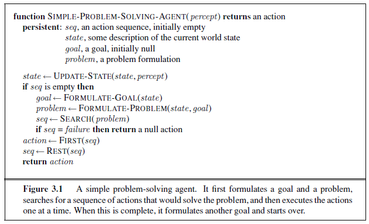
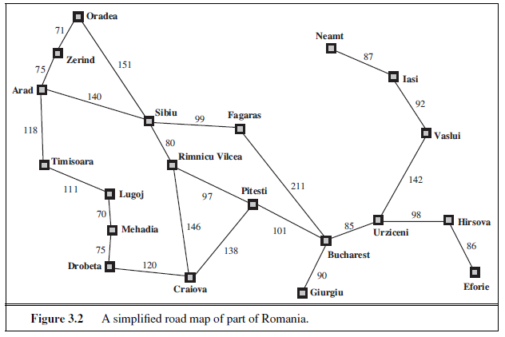

## Resolvendo problemas por busca

  
Com o intuito de solucinar problemas, é necessário defini-los com precisão de uma forma que se permita descrever e encaixar os problemas em algorítmos de busca de uso geral.

### Agente de solução de problemas

  
O objetivo de um algorítmo de busca é maximizar seu desempenho, que além dos dados também pode adotar metas a esses algoritimos, também se busca um menor uso de memória e velocidade de resposta do agente.

  
Para problemas de busca, representações atômicas são mais comumente utilizadas visto que consideram os objetivos e ações futuras comparando com os resultados desejáveis. Essa estrutura adota um ou mais objetivos que treinam seu comportamento para ajudar limitar seus resultados assim como suas ações dentro do problema. Quando o ambiente é desconhecido o agente fará ações de modo aleatório, com várias ações e com vários valores para eventualmente alcançar o resultado esperado.

  
Como exemplo, nas figuras 1 e 2 retiradodos lo livro AI de Russel e Norvig, são demontrados esse pensamento e seu famoso exemplo dos caminhos no mapa da Romênia:

 
<figcaption> </figcaption>

Figura 1 - Algorítimo de Busca

 
<figcaption> </figcaption>

Figura 2 - Mapa da Romênnia

Com isso esse tipo de problema possui as seguintes xaracterísticas:

Reage a estímulos do ambiente.
* não possue estado interno e não é capaz de planejar com antecedência.
* tipo de agente baseado em meta.
* o projetista escolhe e codifica a meta dentro do agente.
* Não funciona bem em ambientes para os quais o mapeamento entre percepções ações é muito grande para ser armazenado ou levaria muito tempo para aprender.
* Não sabem o que suas ações podem realizar, essa informação está implícita nas
regras que mapeiam percepções em ações.

Partindo dos exemplos das figuras 1 e 2, é formulado os objetivos e problemas para a execução do agente e dempendendo se sua malha é fechada, em que seu ambiente muda, ou aberta, em que o ambiente se mantém, e se está indo as cegas ou não, o algorítmo faz sua busca e decide qual caminho seguir. Ou seja  Se um sistema de malha aberta tem como objetivo um único caminho de uma entrada para um resultado e sendo considerado determinístico, e um sistema de malha fechada, não determinístico, que representa um caminho resultante em muitos caminhos, alguns dos quais podem chegar ao mesmo resultado e alguns dos quais podem chegar a resultados únicos 

### Algoritmos de busca

#### Busca cega

São divididas da seguinte maneira:

* **Busca em largura (Breadth-first)** 
  - Partindo dos nós da fronteira, sempre explora o caminho mais curto em quantidade de ações antes. A fronteira é uma FILA (FIFO) e os nós sucessores vão para o fundo da fila em que se encontra a fronteira, porém sempre pega o mais próximo. Esse tipo de busca possui um ótimo custo e é um considerado sistema completo.
* **Busca de custo uniforme** 
  - Faz a busca em largura de modo a encontrar a solução ótima para qualquer valor de passo, e também possuir a estratégia de expandir o nó com menor custo de caminho.
* **Busca em profundidade (depth-first)**
  - Esse método sempre explora o nó mais longe ou mais profundo primeiro e pode ser implementado por best first search onde pussui uma função de valor negativo da profundidade.  Não é considerada ideal em termos de custo, ele retorna a primeira solução encontrada, mesmo que não seja a de menor custo e tem a possibilidade de ficar preso a um loops infinitos. Uma vantagem é a baixa utilização de  memória. 
* **Busca informada ou heurística**
  - A técnica de busca informada utiliza o conhecimento específico do problema para dar uma pista para a solução do problema. Esse tipo de estratégia de pesquisa impede que os algoritmos se confundam no objetivo e na direção da solução. Pode se vantajosa em custo, em que grande porte pela otimização e com custos de pesquisa mais baixos.

### Conclusão

